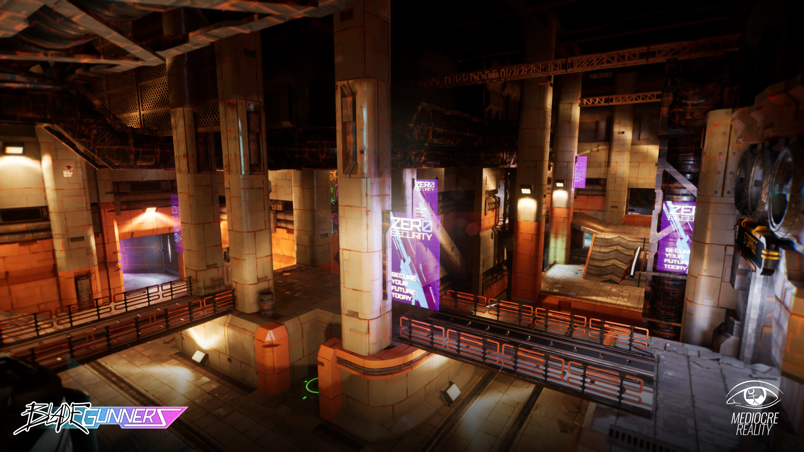

# [BladeGunners](https://mediocrereality.itch.io/bladegunners)
https://mediocrereality.itch.io/bladegunners

# Introduction

BladeGunners is a first-person, online arena shooter game. It utilises skating movement mechanics to allow for rail grinding on certain objects in the arena which will charge up the player's energy-based weapon. 

Set in the distant future where bullets are a thing of the past, private weapons manufacturers seek to covertly field test their weapons through gameshow sponsorships. Players are placed into 2 teams of 4 and must face each other in a deathmatch for the highly desired grand prize. Are you ready Plazmoids?

## Dedicated Server Installation

- Download the Server Build for your OS of choice.
- [**Windows**] Run the console.bat, console, or BladeGunners_Server.exe. The first two will open the server with a console.
- [**Linux**] Run the skating_fpsServer.sh.
- To connect as a client use the IP of the machine hosting the server. **NOTE:** You'll need to ensure other PCs have access to this machine. 

# To Host
- **Download** the Windows Client build.
- **Load** up the Game and Click **'Host'**.
- Wait for Players to connect and Play.

# To Join
- **Download** the Windows Client build.
- **Load** up the Game and enter the **Host's IP** into the box. **NOTE:** If the Host is on the same Network as you then you may also use the server browser.
- **Join** and wait to connect.

# Notes
- To connect online to either a P2P Host or a Dedicated server you must ensure the PC is port-forwarded (for LAN this isn't necessary). UE4's port of choice by default is **TPC/UDP** at **7777**. TLDR: What you'd have to do for a Java Minecraft Server is what you have to do here.

